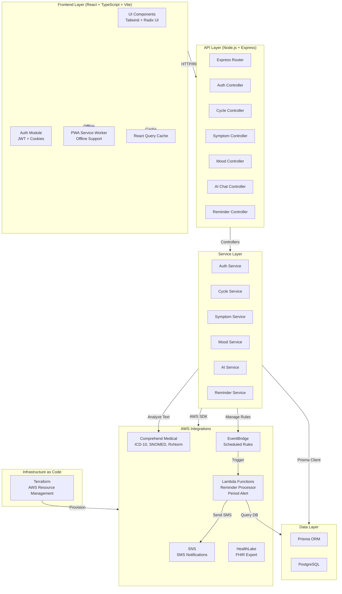

# Design Document: Health Tracking Application

## Overview

The Health Tracking Application is a production-ready full-stack system enabling users to monitor personal health metrics including menstrual cycles, symptoms, mood, and receive AI-powered health insights. The system employs a layered architecture with React frontend, Node.js/Express backend, PostgreSQL database via Prisma ORM, and AWS integrations for notifications and FHIR-compliant health data export. The application prioritizes security (JWT auth, HTTP-only cookies), performance (lazy loading, API caching), and user experience (PWA support, offline-first, dark/light mode, smooth animations).

## System Architecture



## Core Data Models

### User Model
```typescript
interface User {
  id: string                    // UUID primary key
  email: string                 // Unique, indexed
  username: string              // Unique
  passwordHash: string          // bcrypt hashed
  firstName: string
  lastName: string
  dateOfBirth: Date
  timezone: string              // For reminder scheduling
  preferences: {
    darkMode: boolean
    notificationsEnabled: boolean
    healthLakeExportEnabled: boolean
  }
  createdAt: Date
  updatedAt: Date
  
  // Relations
  cycles: Cycle[]
  symptoms: Symptom[]
  moods: Mood[]
  reminders: Reminder[]
  chatHistory: ChatHistory[]
}
```

### Cycle Model
```typescript
interface Cycle {
  id: string
  userId: string                // Foreign key
  startDate: Date               // Period start
  endDate: Date | null          // Period end (nullable)
  cycleLength: number           // Days
  periodLength: number          // Days
  notes: string
  createdAt: Date
  updatedAt: Date
}
```

### Symptom Model
```typescript
interface Symptom {
  id: string
  userId: string
  cycleId: string | null        // Optional relation to cycle
  date: Date
  type: string                  // e.g., "cramps", "headache", "bloating"
  severity: number              // 1-10 scale
  notes: string
  medicalInsights: MedicalInsights | null  // AWS Comprehend Medical analysis results
  createdAt: Date
  updatedAt: Date
}
```

### Mood Model
```typescript
interface Mood {
  id: string
  userId: string
  date: Date
  mood: string                  // e.g., "happy", "anxious", "neutral"
  intensity: number             // 1-10 scale
  triggers: string[]            // Array of mood triggers
  notes: string
  medicalInsights: MedicalInsights | null  // AWS Comprehend Medical analysis results
  createdAt: Date
  updatedAt: Date
}
```

### Reminder Model
```typescript
interface Reminder {
  id: string
  userId: string
  type: string                  // "period_alert", "medication", "custom"
  title: string
  description: string
  scheduledTime: Date
  frequency: string             // "once", "daily", "weekly", "monthly"
  isActive: boolean
  notificationMethod: string    // "sms", "email", "push"
  eventBridgeRuleArn: string | null  // AWS EventBridge rule ARN for scheduling
  createdAt: Date
  updatedAt: Date
}
```

### MedicalInsights Model (stored as JSON on Symptom and Mood)
```typescript
interface MedicalInsights {
  analyzedAt: string              // ISO-8601 timestamp
  sourceText: string              // The text that was analyzed
  entities: {
    conditions: MedicalEntity[]   // MEDICAL_CONDITION category
    medications: MedicalEntity[]  // MEDICATION category
    anatomy: MedicalEntity[]      // ANATOMY category
    symptoms: MedicalEntity[]     // DX_NAME entities
    testsTreatments: MedicalEntity[]  // TEST_TREATMENT_PROCEDURE category
  }
  icd10Codes: MedicalEntityCode[]   // ICD-10-CM codes from InferICD10CM
  rxnormCodes: MedicalEntityCode[]  // RxNorm codes from InferRxNorm
  snomedCodes: MedicalEntityCode[]  // SNOMED CT codes from InferSNOMEDCT
  rawEntityCount: number
}

interface MedicalEntity {
  text: string          // Extracted text span
  score: number         // Confidence 0.0-1.0
  type: string          // Entity type (DX_NAME, GENERIC_NAME, etc.)
  traits: string[]      // e.g., ["NEGATION", "SYMPTOM"]
  codes: {
    icd10?: MedicalEntityCode[]
    rxnorm?: MedicalEntityCode[]
    snomed?: MedicalEntityCode[]
  }
}

interface MedicalEntityCode {
  code: string          // e.g., "F41.9", "5640", "48694002"
  description: string   // e.g., "Anxiety disorder, unspecified"
  score: number         // Confidence 0.0-1.0
}
```

### ChatHistory Model
```typescript
interface ChatHistory {
  id: string
  userId: string
  message: string               // User message
  response: string              // AI response
  context: {
    recentMoods: Mood[]
    recentSymptoms: Symptom[]
    currentCycle: Cycle | null
  }
  createdAt: Date
}
```

## API Endpoints & Controllers

### Authentication Endpoints

```typescript
// POST /auth/signup
interface SignupRequest {
  email: string
  password: string
  firstName: string
  lastName: string
  dateOfBirth: Date
}

interface SignupResponse {
  user: {
    id: string
    email: string
    firstName: string
  }
  token: string
}

// POST /auth/login
interface LoginRequest {
  email: string
  password: string
}

interface LoginResponse {
  user: {
    id: string
    email: string
    firstName: string
  }
  token: string
}

// POST /auth/logout
// Returns: { success: boolean }

// GET /auth/me
// Returns: Current user profile
```

### Cycle Endpoints

```typescript
// GET /cycles - List all cycles for user
// Returns: Cycle[]

// POST /cycles - Create new cycle
interface CreateCycleRequest {
  startDate: Date
  periodLength: number
  cycleLength: number
  notes?: string
}

// GET /cycles/:id - Get cycle details
// PATCH /cycles/:id - Update cycle
// DELETE /cycles/:id - Delete cycle
```

### Symptom Endpoints

```typescript
// GET /symptoms - List symptoms (with optional date range filter)
// POST /symptoms - Log new symptom
interface LogSymptomRequest {
  type: string
  severity: number              // 1-10
  date: Date
  cycleId?: string
  notes?: string
}

// GET /symptoms/:id
// PATCH /symptoms/:id
// DELETE /symptoms/:id
```

### Mood Endpoints

```typescript
// GET /moods - List moods (with optional date range filter)
// POST /moods - Log new mood
interface LogMoodRequest {
  mood: string
  intensity: number             // 1-10
  date: Date
  triggers?: string[]
  notes?: string
}

// GET /moods/:id
// PATCH /moods/:id
// DELETE /moods/:id
```

### Reminder Endpoints

```typescript
// GET /reminders - List all reminders
// POST /reminders - Create reminder
interface CreateReminderRequest {
  type: string
  title: string
  description: string
  scheduledTime: Date
  frequency: string
  notificationMethod: string
}

// GET /reminders/:id
// PATCH /reminders/:id
// DELETE /reminders/:id
```

### AI Chat Endpoint

```typescript
// POST /ai/chat
interface ChatRequest {
  message: string
}

interface ChatResponse {
  response: string
  context: {
    recentMoods: Mood[]
    recentSymptoms: Symptom[]
    currentCycle: Cycle | null
  }
}
```

## Backend Service Layer Architecture

### Authentication Service

```typescript
class AuthService {
  // Precondition: email is valid, password meets requirements
  // Postcondition: user created with hashed password, JWT token generated
  async signup(email: string, password: string, userData: UserData): Promise<{user: User, token: string}>
  
  // Precondition: email exists, password is correct
  // Postcondition: JWT token generated, user session established
  async login(email: string, password: string): Promise<{user: User, token: string}>
  
  // Precondition: valid JWT token provided
  // Postcondition: token validated, user identity confirmed
  async validateToken(token: string): Promise<User>
  
  // Precondition: user authenticated
  // Postcondition: session cleared, token invalidated
  async logout(userId: string): Promise<void>
}
```

### Cycle Service

```typescript
class CycleService {
  // Precondition: userId valid, startDate is valid date
  // Postcondition: cycle record created with calculated fields
  async createCycle(userId: string, data: CreateCycleRequest): Promise<Cycle>
  
  // Precondition: userId valid
  // Postcondition: all cycles for user returned, sorted by date descending
  async getUserCycles(userId: string): Promise<Cycle[]>
  
  // Precondition: cycleId exists, belongs to userId
  // Postcondition: cycle updated, timestamps refreshed
  async updateCycle(cycleId: string, data: Partial<Cycle>): Promise<Cycle>
  
  // Precondition: cycleId exists
  // Postcondition: cycle deleted, related data handled
  async deleteCycle(cycleId: string): Promise<void>
  
  // Precondition: userId valid
  // Postcondition: returns current active cycle or null
  async getCurrentCycle(userId: string): Promise<Cycle | null>
}
```

### Symptom Service

```typescript
class SymptomService {
  // Precondition: userId valid, symptom data valid
  // Postcondition: symptom record created
  async logSymptom(userId: string, data: LogSymptomRequest): Promise<Symptom>
  
  // Precondition: userId valid, optional date range provided
  // Postcondition: symptoms returned, filtered and sorted by date
  async getUserSymptoms(userId: string, startDate?: Date, endDate?: Date): Promise<Symptom[]>
  
  // Precondition: symptomId exists, belongs to userId
  // Postcondition: symptom updated
  async updateSymptom(symptomId: string, data: Partial<Symptom>): Promise<Symptom>
  
  // Precondition: symptomId exists
  // Postcondition: symptom deleted
  async deleteSymptom(symptomId: string): Promise<void>
}
```

### Mood Service

```typescript
class MoodService {
  // Precondition: userId valid, mood data valid
  // Postcondition: mood record created
  async logMood(userId: string, data: LogMoodRequest): Promise<Mood>
  
  // Precondition: userId valid, optional date range provided
  // Postcondition: moods returned, filtered and sorted by date
  async getUserMoods(userId: string, startDate?: Date, endDate?: Date): Promise<Mood[]>
  
  // Precondition: moodId exists, belongs to userId
  // Postcondition: mood updated
  async updateMood(moodId: string, data: Partial<Mood>): Promise<Mood>
  
  // Precondition: moodId exists
  // Postcondition: mood deleted
  async deleteMood(moodId: string): Promise<void>
}
```

### AI Chat Service

```typescript
class AIChatService {
  // Precondition: userId valid, message non-empty
  // Postcondition: AI response generated using context, chat history saved
  async chat(userId: string, message: string): Promise<ChatResponse>
  
  // Precondition: userId valid
  // Postcondition: recent context (moods, symptoms, cycle) retrieved
  async buildContext(userId: string): Promise<ChatContext>
  
  // Precondition: userId valid, optional limit provided
  // Postcondition: chat history returned, most recent first
  async getChatHistory(userId: string, limit?: number): Promise<ChatHistory[]>
}
```

### Reminder Service

```typescript
class ReminderService {
  // Precondition: userId valid, reminder data valid
  // Postcondition: reminder created, scheduled job registered
  async createReminder(userId: string, data: CreateReminderRequest): Promise<Reminder>
  
  // Precondition: userId valid
  // Postcondition: all active reminders for user returned
  async getUserReminders(userId: string): Promise<Reminder[]>
  
  // Precondition: reminderId exists, belongs to userId
  // Postcondition: reminder updated, job rescheduled if time changed
  async updateReminder(reminderId: string, data: Partial<Reminder>): Promise<Reminder>
  
  // Precondition: reminderId exists
  // Postcondition: reminder deleted, scheduled job cancelled
  async deleteReminder(reminderId: string): Promise<void>
  
  // Precondition: reminderId exists, is active
  // Postcondition: SMS sent via SNS, delivery logged
  async sendReminder(reminderId: string): Promise<void>
}
```

## Frontend Architecture

### Core Screens & Components

```typescript
// Authentication Screens
interface LoginScreen {
  email: string
  password: string
  onSubmit: (credentials: LoginRequest) => Promise<void>
  isLoading: boolean
  error: string | null
}

interface SignupScreen {
  form: {
    email: string
    password: string
    firstName: string
    lastName: string
    dateOfBirth: Date
  }
  onSubmit: (data: SignupRequest) => Promise<void>
  isLoading: boolean
  error: string | null
}

// Dashboard Screen
interface DashboardScreen {
  currentCycle: Cycle | null
  recentMoods: Mood[]
  recentSymptoms: Symptom[]
  upcomingReminders: Reminder[]
  onNavigate: (screen: string) => void
}

// Cycle Tracker Screen
interface CycleTrackerScreen {
  cycles: Cycle[]
  currentCycle: Cycle | null
  onCreateCycle: (data: CreateCycleRequest) => Promise<void>
  onUpdateCycle: (cycleId: string, data: Partial<Cycle>) => Promise<void>
  onDeleteCycle: (cycleId: string) => Promise<void>
}

// Symptom Logger Screen
interface SymptomLoggerScreen {
  symptoms: Symptom[]
  onLogSymptom: (data: LogSymptomRequest) => Promise<void>
  onDeleteSymptom: (symptomId: string) => Promise<void>
  dateFilter: { start: Date; end: Date }
}

// Mood Tracker Screen
interface MoodTrackerScreen {
  moods: Mood[]
  onLogMood: (data: LogMoodRequest) => Promise<void>
  onDeleteMood: (moodId: string) => Promise<void>
  dateFilter: { start: Date; end: Date }
}

// AI Chat Assistant Screen
interface AIChatScreen {
  chatHistory: ChatHistory[]
  isLoading: boolean
  onSendMessage: (message: string) => Promise<void>
  error: string | null
}
```

### UI Component Library (Radix UI + Tailwind)

```typescript
// Reusable components
interface CardComponent {
  title: string
  children: React.ReactNode
  onClick?: () => void
  className?: string
}

interface ButtonComponent {
  label: string
  onClick: () => void
  variant: "primary" | "secondary" | "danger"
  isLoading?: boolean
  disabled?: boolean
}

interface InputComponent {
  label: string
  type: string
  value: string
  onChange: (value: string) => void
  error?: string
  placeholder?: string
}

interface ModalComponent {
  isOpen: boolean
  title: string
  children: React.ReactNode
  onClose: () => void
  actions: { label: string; onClick: () => void }[]
}
```

### Animation Specifications (Framer Motion)

```typescript
// Page Transitions
const pageTransition = {
  initial: { opacity: 0, y: 20 },
  animate: { opacity: 1, y: 0 },
  exit: { opacity: 0, y: -20 },
  transition: { duration: 0.3 }
}

// Card Hover Effect
const cardHover = {
  whileHover: { scale: 1.02, boxShadow: "0 10px 25px rgba(0,0,0,0.1)" },
  transition: { duration: 0.2 }
}

// Button Tap Feedback
const buttonTap = {
  whileTap: { scale: 0.95 },
  transition: { duration: 0.1 }
}

// Loading Skeleton Shimmer
const shimmer = {
  initial: { backgroundPosition: "200% center" },
  animate: { backgroundPosition: "-200% center" },
  transition: { duration: 1.5, repeat: Infinity }
}

// Chart Animation
const chartAnimation = {
  initial: { opacity: 0, y: 20 },
  animate: { opacity: 1, y: 0 },
  transition: { duration: 0.5, staggerChildren: 0.1 }
}
```

## Authentication Flow

```typescript
// Signup Flow
interface SignupFlow {
  // Step 1: User submits signup form
  // Precondition: email valid, password meets requirements (min 8 chars, mixed case, number)
  // Postcondition: validation passed
  validateSignupInput(data: SignupRequest): { valid: boolean; errors: string[] }
  
  // Step 2: Hash password with bcrypt
  // Precondition: password is plain text
  // Postcondition: password hashed with salt rounds = 10
  hashPassword(password: string): Promise<string>
  
  // Step 3: Create user in database
  // Precondition: email unique, password hashed
  // Postcondition: user record created with timestamps
  createUser(data: SignupRequest, passwordHash: string): Promise<User>
  
  // Step 4: Generate JWT token
  // Precondition: user created successfully
  // Postcondition: JWT token generated with 7-day expiry
  generateToken(userId: string): string
  
  // Step 5: Set HTTP-only cookie
  // Precondition: token generated
  // Postcondition: cookie set with secure, httpOnly, sameSite flags
  setAuthCookie(response: Response, token: string): void
}

// Login Flow
interface LoginFlow {
  // Step 1: Validate input
  // Precondition: email and password provided
  // Postcondition: validation passed
  validateLoginInput(data: LoginRequest): { valid: boolean; errors: string[] }
  
  // Step 2: Find user by email
  // Precondition: email valid
  // Postcondition: user found or null
  findUserByEmail(email: string): Promise<User | null>
  
  // Step 3: Compare passwords
  // Precondition: user found, password provided
  // Postcondition: comparison result boolean
  comparePasswords(plainPassword: string, hashedPassword: string): Promise<boolean>
  
  // Step 4: Generate JWT token
  // Precondition: password matches
  // Postcondition: JWT token generated
  generateToken(userId: string): string
  
  // Step 5: Set HTTP-only cookie
  // Precondition: token generated
  // Postcondition: cookie set with secure flags
  setAuthCookie(response: Response, token: string): void
}

// Auth Middleware
interface AuthMiddleware {
  // Precondition: request contains cookie or Authorization header
  // Postcondition: JWT validated, user attached to request
  verifyToken(token: string): Promise<User>
  
  // Precondition: request received
  // Postcondition: if valid token, next() called; else 401 returned
  authenticate(req: Request, res: Response, next: NextFunction): Promise<void>
}
```

## AWS Integrations

### Comprehend Medical Integration (Medical NLP)

```typescript
class ComprehendMedicalService {
  // Precondition: text is at least 3 characters
  // Postcondition: MedicalInsights returned with entities and medical codes
  // Runs 4 APIs in parallel: DetectEntitiesV2, InferICD10CM, InferRxNorm, InferSNOMEDCT
  async analyzeText(text: string): Promise<MedicalInsights | null>
}

// Integration Points:
// - Auto-analysis: SymptomService.logSymptom triggers background analysis (non-blocking)
// - Auto-analysis: MoodService.logMood triggers background analysis with combined text
// - On-demand: POST /symptoms/:id/analyze — synchronous re-analysis
// - On-demand: POST /moods/:id/analyze — synchronous re-analysis
// - Results stored as medicalInsights Json? field on Symptom and Mood models
//
// Medical Codes Extracted:
// - ICD-10-CM: e.g., F41.9 (Anxiety), G44.209 (Tension headache), N94 (Menstrual pain)
// - RxNorm: e.g., 5640 (ibuprofen)
// - SNOMED CT: e.g., 431416001 (Menstrual cramp), 48694002 (Anxiety)
```

### Lambda + EventBridge Integration (Serverless Reminders)

```typescript
// Lambda Functions (in lambda/ folder)
// reminder-processor: Processes individual reminder notifications
//   - Triggered by EventBridge per-reminder scheduled rules
//   - Receives { reminderId } as event payload
//   - Queries DB for reminder + user, sends SMS via SNS
//   - One-time reminders: deactivates and self-cleans EventBridge rule after firing
//
// period-alert: Daily period start check
//   - Triggered by EventBridge at 8 AM UTC daily
//   - Queries cycles starting today, sends SMS to each user

class EventBridgeService {
  // Precondition: reminder has valid frequency and scheduledTime
  // Postcondition: EventBridge rule created/updated, Lambda target set
  async upsertReminderRule(reminder: ReminderShape): Promise<string>

  // Precondition: reminderId provided
  // Postcondition: EventBridge rule and targets removed
  async deleteReminderRule(reminderId: string): Promise<void>

  // Precondition: LAMBDA_PERIOD_ALERT_ARN env var set
  // Postcondition: Daily 8 AM UTC rule exists (idempotent)
  async ensurePeriodAlertRule(): Promise<void>
}

// EventBridge Cron Format: cron(min hr dom mon dow yr)
// - daily:   cron(30 14 * * ? *)        — every day at 14:30 UTC
// - weekly:  cron(30 14 ? * 3 *)        — every Tuesday at 14:30 UTC
// - monthly: cron(30 14 15 * ? *)       — 15th of each month at 14:30 UTC
// - once:    cron(30 14 15 6 ? 2026)    — June 15, 2026 at 14:30 UTC
//
// Rule naming: reminder-{reminderId} for individual reminders
//              period-alert-daily for the daily period check
```

### SNS Integration (SMS Notifications)

```typescript
class SNSNotificationService {
  // Precondition: phone number valid
  // Postcondition: SMS sent via SNS Publish
  async sendSMS(phoneNumber: string, message: string): Promise<void>

  // Precondition: title and phone number provided
  // Postcondition: formatted reminder SMS sent
  async sendReminderSMS(phoneNumber: string, title: string, description: string): Promise<void>

  // Precondition: phone number provided
  // Postcondition: period alert SMS sent
  async sendPeriodAlert(phoneNumber: string): Promise<void>
}
```

### HealthLake Integration (FHIR Export)

```typescript
class HealthLakeService {
  // Precondition: userId valid, user has health data
  // Postcondition: health data converted to FHIR format, exported to HealthLake
  async exportHealthDataToFHIR(userId: string): Promise<void>

  // Precondition: cycle data exists
  // Postcondition: cycle converted to FHIR Observation resource
  convertCycleToFHIR(cycle: Cycle): FHIRObservation

  // Precondition: symptom data exists
  // Postcondition: symptom converted to FHIR Condition resource
  convertSymptomToFHIR(symptom: Symptom): FHIRCondition

  // Precondition: mood data exists
  // Postcondition: mood converted to FHIR Observation resource
  convertMoodToFHIR(mood: Mood): FHIRObservation
}

// FHIR Export Rules:
// - Only export summarized medical records (aggregated data)
// - Do NOT store raw app data in HealthLake
// - Trigger export: After significant health events or user-requested export
// - Include: Period cycles, symptom patterns, mood trends
// - Exclude: Raw chat history, personal notes
```

### Terraform Infrastructure (terraform/ folder)

```
terraform/
├── main.tf              # AWS provider, data sources
├── variables.tf         # region, project name, database URL, environment
├── iam.tf               # Lambda execution role + Express app IAM user with policies
├── lambda.tf            # Both Lambda functions with zip packaging
├── eventbridge.tf       # Period alert daily rule + Lambda permissions
├── outputs.tf           # Lambda ARNs, IAM credentials, .env.local snippet
└── terraform.tfvars     # User-specific values (gitignored)

# Resources provisioned (19 total):
# - 2 Lambda functions (reminder-processor, period-alert)
# - 2 CloudWatch Log Groups (14-day retention)
# - 1 EventBridge rule (period-alert-daily, cron 8 AM UTC)
# - 1 EventBridge target (period-alert Lambda)
# - 1 IAM role (Lambda execution) with 3 inline policies
# - 1 IAM user (Express app) with 5 inline policies
# - 1 IAM access key
# - 2 Lambda permissions (EventBridge → Lambda)
#
# IAM Policies for Express app:
# - sns:Publish
# - comprehendmedical:DetectEntitiesV2, InferICD10CM, InferRxNorm, InferSNOMEDCT
# - events:PutRule, PutTargets, RemoveTargets, DeleteRule, DescribeRule
# - lambda:AddPermission, RemovePermission
# - healthlake:CreateResource, ReadResource, UpdateResource
```

## Error Handling & Validation

```typescript
// Global Error Handler
interface ErrorHandler {
  // Precondition: error thrown in any route/service
  // Postcondition: error logged, appropriate HTTP response sent
  handleError(error: Error, req: Request, res: Response): void
}

// Input Validation (Zod)
const signupSchema = z.object({
  email: z.string().email("Invalid email"),
  password: z.string().min(8, "Password must be 8+ characters").regex(/[A-Z]/, "Must contain uppercase").regex(/[0-9]/, "Must contain number"),
  firstName: z.string().min(1, "First name required"),
  lastName: z.string().min(1, "Last name required"),
  dateOfBirth: z.date()
})

const logSymptomSchema = z.object({
  type: z.enum(["cramps", "headache", "bloating", "fatigue", "mood_swings", "other"]),
  severity: z.number().min(1).max(10),
  date: z.date(),
  notes: z.string().optional()
})

// Rate Limiting
interface RateLimiter {
  // Precondition: request received
  // Postcondition: if rate limit exceeded, 429 returned; else next() called
  limit(req: Request, res: Response, next: NextFunction): void
}

// Security Headers
interface SecurityHeaders {
  // Precondition: response object
  // Postcondition: security headers set (CORS, CSP, X-Frame-Options, etc.)
  setSecurityHeaders(res: Response): void
}
```

## Performance Optimization

```typescript
// React Query Caching
interface CacheStrategy {
  // Precondition: API endpoint called
  // Postcondition: response cached for 5 minutes
  cyclesQuery: useQuery({
    queryKey: ['cycles'],
    queryFn: fetchCycles,
    staleTime: 5 * 60 * 1000
  })
  
  // Precondition: mood data requested
  // Postcondition: response cached for 10 minutes
  moodsQuery: useQuery({
    queryKey: ['moods'],
    queryFn: fetchMoods,
    staleTime: 10 * 60 * 1000
  })
}

// Lazy Loading Components
interface LazyLoadingStrategy {
  // Precondition: component not yet visible
  // Postcondition: component loaded on demand
  CycleTrackerScreen: React.lazy(() => import('./screens/CycleTracker'))
  SymptomLoggerScreen: React.lazy(() => import('./screens/SymptomLogger'))
  AIChatScreen: React.lazy(() => import('./screens/AIChat'))
}

// Database Query Optimization
interface QueryOptimization {
  // Precondition: userId provided
  // Postcondition: indexed query returns cycles in < 100ms
  getUserCycles: prisma.cycle.findMany({
    where: { userId },
    orderBy: { startDate: 'desc' },
    take: 12
  })
  
  // Precondition: userId and date range provided
  // Postcondition: indexed query returns symptoms in < 100ms
  getUserSymptomsByDateRange: prisma.symptom.findMany({
    where: {
      userId,
      date: { gte: startDate, lte: endDate }
    },
    orderBy: { date: 'desc' }
  })
}
```

## Correctness Properties

*A property is a characteristic or behavior that should hold true across all valid executions of a system—essentially, a formal statement about what the system should do. Properties serve as the bridge between human-readable specifications and machine-verifiable correctness guarantees.*

### Property 1: Password Hashing Security

For any user signup, the stored password hash must be different from the input password and must be a valid bcrypt hash.

**Validates: Requirements 1.4**

### Property 2: JWT Token Validity and Expiry

For any successful login, the returned JWT token must be valid and must have an expiry time of exactly 7 days from the current time.

**Validates: Requirements 2.1**

### Property 3: Token Validation and User Identity

For any valid JWT token provided in a request, the token must decode successfully and must attach the correct user identity to the request.

**Validates: Requirements 2.5**

### Property 4: Cycle Date Ordering

For any cycle record, the start date must be less than or equal to the end date, or the end date must be null (indicating an ongoing cycle).

**Validates: Requirements 5.1, 5.4**

### Property 5: User Data Isolation in Cycles

For any set of cycles retrieved for a user, all cycles in the result set must belong to that user (cycle.userId equals the requested userId).

**Validates: Requirements 5.3**

### Property 6: Symptom Severity Range

For any symptom logged, the severity value must be between 1 and 10 inclusive.

**Validates: Requirements 6.2**

### Property 7: Symptom Date Range Filtering

For any symptom query with a date range filter, all returned symptoms must have dates within the specified range (startDate ≤ symptom.date ≤ endDate).

**Validates: Requirements 6.5**

### Property 8: Mood Intensity Range

For any mood logged, the intensity value must be between 1 and 10 inclusive.

**Validates: Requirements 7.2**

### Property 9: Mood Type Validation

For any mood logged, the mood type must be one of the predefined types: happy, anxious, neutral, sad, energetic, calm, irritable, or other.

**Validates: Requirements 7.3**

### Property 10: Mood Date Range Filtering

For any mood query with a date range filter, all returned moods must have dates within the specified range (startDate ≤ mood.date ≤ endDate).

**Validates: Requirements 7.5**

### Property 11: Reminder Active Status Default

For any reminder created, the isActive flag must be set to true by default.

**Validates: Requirements 8.5**

### Property 12: Reminder Scheduled Time Validation

For any reminder created, the scheduled time must be in the future (scheduledTime > now()).

**Validates: Requirements 8.2**

### Property 13: User Data Isolation in Reminders

For any set of reminders retrieved for a user, all reminders in the result set must belong to that user and must be active (reminder.userId equals the requested userId and reminder.isActive = true).

**Validates: Requirements 8.6**

### Property 14: AI Chat Response Non-Empty

For any message sent to the AI chat, the response must be non-empty and must be contextually relevant to the input message.

**Validates: Requirements 10.1**

### Property 15: Chat History Sorting

For any chat history retrieved, the messages must be sorted by creation date in descending order (most recent first).

**Validates: Requirements 10.5**

### Property 16: FHIR Cycle Conversion

For any cycle exported to FHIR format, the cycle must be converted to a valid FHIR Observation resource with appropriate fields mapped.

**Validates: Requirements 11.2**

### Property 17: FHIR Symptom Conversion

For any symptom exported to FHIR format, the symptom must be converted to a valid FHIR Condition resource with appropriate fields mapped.

**Validates: Requirements 11.3**

### Property 18: FHIR Mood Conversion

For any mood exported to FHIR format, the mood must be converted to a valid FHIR Observation resource with appropriate fields mapped.

**Validates: Requirements 11.4**

### Property 19: Health Data Export Exclusion

For any health data export, raw chat history and personal notes must be excluded from the export (only aggregated data is included).

**Validates: Requirements 11.5, 11.6**

### Property 20: Service Worker Asset Caching

For any application load, the Service Worker must register successfully and must cache essential assets for offline access.

**Validates: Requirements 12.1**

### Property 21: Offline Read Operations

For any read operation (viewing cycles, symptoms, moods) performed while offline, the operation must succeed using cached data.

**Validates: Requirements 12.3**

### Property 22: Offline Write Operation Queuing

For any write operation (create, update, delete) performed while offline, the operation must be queued for later sync.

**Validates: Requirements 12.4**

### Property 23: Theme Preference Persistence

For any user theme preference change, the preference must be persisted to the database and must be applied on subsequent logins.

**Validates: Requirements 13.1, 13.4**

### Property 24: Input Validation Error Messages

For any form submission with invalid data, specific validation error messages must be displayed for each invalid field.

**Validates: Requirements 15.1**

### Property 25: HTTP Status Code Correctness

For any API request that fails, the response must include an appropriate HTTP status code (401 for unauthorized, 403 for forbidden, 404 for not found, 500 for server error).

**Validates: Requirements 15.2, 15.4, 15.5, 15.6**

### Property 26: Rate Limiting Enforcement

For any client making more than 100 requests in 15 minutes, the system must return a 429 Too Many Requests response.

**Validates: Requirements 16.1**

### Property 27: Security Headers Presence

For any HTTP response, security headers must be included (X-Frame-Options, X-Content-Type-Options, Strict-Transport-Security).

**Validates: Requirements 16.3**

### Property 28: SQL Injection Prevention

For any user input submitted to the system, SQL injection attacks must be prevented through parameterized queries via Prisma ORM.

**Validates: Requirements 16.5**

### Property 29: Query Performance - Cycles

For any user retrieving their cycles, the database query must complete in less than 100ms using indexed queries.

**Validates: Requirements 17.1**

### Property 30: Query Performance - Symptoms

For any user retrieving symptoms with a date range filter, the database query must complete in less than 100ms using indexed queries.

**Validates: Requirements 17.2**

### Property 31: Query Performance - Moods

For any user retrieving moods with a date range filter, the database query must complete in less than 100ms using indexed queries.

**Validates: Requirements 17.3**

### Property 32: React Query Cache - Cycles

For any cycle retrieval, the response must be cached for 5 minutes using React Query.

**Validates: Requirements 18.1**

### Property 33: React Query Cache - Moods

For any mood retrieval, the response must be cached for 10 minutes using React Query.

**Validates: Requirements 18.2**

### Property 34: React Query Cache - Symptoms

For any symptom retrieval, the response must be cached for 10 minutes using React Query.

**Validates: Requirements 18.3**

### Property 35: Cache Invalidation on Data Mutation

For any create, update, or delete operation, the relevant cache entries must be invalidated to ensure fresh data on next retrieval.

**Validates: Requirements 18.4**

### Property 36: Lazy Loading of Non-Critical Screens

For any application load, non-critical screens (CycleTracker, SymptomLogger, AIChat) must be lazy loaded and not included in the initial bundle.

**Validates: Requirements 19.1**

### Property 37: Keyboard Navigation Accessibility

For any interactive element in the application, keyboard navigation must be supported and must be accessible via Tab and Enter keys.

**Validates: Requirements 20.1**

### Property 38: ARIA Labels and Semantic HTML

For any UI component, appropriate ARIA labels and semantic HTML must be present for screen reader compatibility.

**Validates: Requirements 20.2**

### Property 39: Comprehend Medical Analysis Completeness

For any symptom or mood with notes longer than 2 characters, the medicalInsights field must be populated after analysis with valid entities, ICD-10 codes, RxNorm codes, and SNOMED codes. The analyzedAt timestamp must be set and sourceText must match the input.

**Validates: Requirements 9.1, 9.2**

### Property 40: Comprehend Medical Non-Blocking

For any symptom or mood creation with notes, the API response must return immediately with medicalInsights as null. Background analysis populates the field asynchronously without blocking the creation response.

**Validates: Requirements 9.2**

### Property 41: EventBridge Rule Lifecycle

For any reminder created with isActive=true, an EventBridge rule named `reminder-{id}` must be created. When a reminder is deleted or deactivated, the corresponding EventBridge rule must be removed. One-time reminders must self-cleanup after firing.

**Validates: Requirements 9.6, 9.7**

### Property 42: EventBridge Cron Expression Correctness

For any reminder frequency (daily, weekly, monthly, once), the generated EventBridge cron expression must use UTC times, correctly handle the day-of-week vs day-of-month mutual exclusion (? placeholder), and produce a valid 6-field cron expression.

**Validates: Requirements 9.6**

### Property 43: Lambda Error Handling

For any Lambda invocation, unhandled errors must be caught, logged to CloudWatch, and re-thrown for EventBridge retry. Database connection failures must not silently swallow errors.

**Validates: Requirements 9.5**

### Property 44: Terraform Infrastructure Idempotency

For any terraform apply, all resources must be idempotent — running apply multiple times must not create duplicate resources or fail. The ensurePeriodAlertRule call at Express startup must also be idempotent.

**Validates: Requirements 9.8**

## Testing Strategy

### Unit Testing Approach

Test each service layer function independently with mocked dependencies:
- Auth Service: signup, login, token validation, password hashing
- Cycle Service: CRUD operations, date calculations, current cycle detection
- Symptom Service: logging, filtering by date range, severity validation
- Mood Service: logging, intensity validation, trigger tracking
- AI Chat Service: message processing, context building, history retrieval
- Reminder Service: creation, scheduling, cancellation

### Property-Based Testing Approach

**Property Test Library**: fast-check (for TypeScript/JavaScript)

Key properties to test:
- Date range queries always return data within specified range
- Severity/intensity values always within 1-10 range
- User data isolation: queries for userId A never return data from userId B
- Cycle dates: startDate always ≤ endDate
- Password hashing: same password always produces different hashes (due to salt)
- JWT tokens: valid tokens always decode to correct user ID
- Reminder scheduling: scheduled time always in future

### Integration Testing Approach

Test complete workflows:
- Signup → Login → Create Cycle → Log Symptom → View Dashboard
- Login → Create Reminder → Receive SMS notification
- Login → Chat with AI → Verify context includes recent moods/symptoms
- Export health data → Verify FHIR format compliance

## Security Considerations

- **Password Security**: Bcrypt with 10 salt rounds, minimum 8 characters with mixed case and numbers
- **JWT Security**: 7-day expiry, HTTP-only cookies, secure flag, sameSite=strict
- **Input Validation**: Zod schemas for all endpoints, sanitize user inputs
- **Rate Limiting**: 100 requests per 15 minutes per IP
- **CORS**: Whitelist frontend domain only
- **HTTPS**: Enforce in production
- **Environment Variables**: Store secrets (JWT_SECRET, AWS credentials, OpenAI key) in .env
- **SQL Injection Prevention**: Use Prisma ORM (parameterized queries)
- **XSS Prevention**: React auto-escapes, Content Security Policy headers
- **CSRF Protection**: SameSite cookies, CSRF tokens for state-changing operations

## Performance Considerations

- **Frontend**: Lazy load screens, React Query caching (5-10 min stale time), code splitting with Vite
- **Backend**: Database indexes on userId, date fields; connection pooling; response compression
- **Database**: Indexed queries on userId, date; pagination for large result sets; query optimization
- **Caching**: Redis for session storage (optional), API response caching
- **PWA**: Service worker caches assets, offline-first for read operations

## Dependencies

**Frontend**:
- react, react-dom, typescript, vite
- tailwindcss, radix-ui
- framer-motion
- react-query
- axios
- zod

**Backend**:
- express, typescript, node
- prisma, @prisma/client, @prisma/adapter-pg, pg
- bcryptjs
- jsonwebtoken
- zod
- @aws-sdk/client-sns
- @aws-sdk/client-healthlake
- @aws-sdk/client-comprehendmedical
- @aws-sdk/client-eventbridge
- @aws-sdk/client-lambda
- @google/generative-ai (Gemini 1.5-flash)
- cors, helmet, express-rate-limit

**Lambda** (separate package in lambda/):
- @prisma/client, @prisma/adapter-pg, pg
- @aws-sdk/client-eventbridge (reminder-processor only)
- @aws-sdk/client-sns

**Infrastructure**:
- terraform (>= 1.5.0)
- hashicorp/aws provider (~> 5.0)

**Database**:
- postgresql
- prisma (ORM)

**Deployment**:
- Vercel (frontend)
- Render/Railway (backend)
- Supabase/Neon (PostgreSQL)


## Domain 1: Safety & Emergency

### Data Models

```typescript
interface SOSAlert {
  id: string
  userId: string
  timestamp: Date
  latitude: number
  longitude: number
  audioEvidenceUrl: string | null  // S3 URL with private ACL
  contactsNotified: string[]        // Array of phone numbers
  emergencyServiceCalled: boolean
  status: "active" | "resolved"
  createdAt: Date
}

interface SafeWalkSession {
  id: string
  userId: string
  startTime: Date
  expectedArrival: Date
  currentLatitude: number
  currentLongitude: number
  trustedContacts: string[]         // Phone numbers
  trackingLink: string              // Public URL for contacts
  arrivedSafely: boolean
  autoSOSTriggered: boolean
  createdAt: Date
  updatedAt: Date
}

interface EscapePlan {
  id: string
  userId: string
  // All data encrypted client-side, stored in IndexedDB only
  // Never sent to server or stored in DynamoDB
  encryptedData: string             // AES-256 encrypted JSON
  decoyScreenActive: boolean
  createdAt: Date
  updatedAt: Date
}

interface IncidentReport {
  id: string
  userId: string | null             // Always null - anonymous
  timestamp: Date
  latitude: number
  longitude: number
  incidentType: "catcalling" | "following" | "assault" | "other"
  severity: number                  // 1-5 scale
  description: string
  createdAt: Date
}
```

### API Endpoints

```typescript
// SOS Panic Button
POST /safety/sos
  Request: { latitude: number, longitude: number }
  Response: { sosAlertId: string, contactsNotified: number, emergencyServiceCalled: boolean }
  Precondition: User authenticated, location available
  Postcondition: SMS sent to all trusted contacts within 10 seconds, audio recorded, emergency call placed

// Safe Walk
POST /safety/safe-walk/start
  Request: { expectedArrival: Date, trustedContacts: string[] }
  Response: { sessionId: string, trackingLink: string }

GET /safety/safe-walk/:sessionId
  Response: { session: SafeWalkSession, currentLocation: { lat, lng } }

POST /safety/safe-walk/:sessionId/arrived
  Response: { success: boolean }

// Incident Report
POST /safety/incident-report
  Request: { incidentType: string, severity: number, description: string }
  Response: { reportId: string, heatmapUpdated: boolean }
  Precondition: Location available
  Postcondition: Report stored anonymously, geofence alert triggered for nearby users

GET /safety/incident-heatmap
  Query: { latitude: number, longitude: number, radiusKm: number }
  Response: { incidents: IncidentReport[], riskLevel: "low" | "medium" | "high" }
```

### Services

```typescript
class SafetyService {
  async triggerSOS(userId: string, latitude: number, longitude: number): Promise<SOSAlert>
  async recordAudioEvidence(audioBlob: Blob): Promise<string>  // Returns S3 URL
  async notifyTrustedContacts(userId: string, location: { lat, lng }): Promise<void>
  async callEmergencyServices(userId: string, country: string): Promise<void>
}

class SafeWalkService {
  async startSafeWalk(userId: string, expectedArrival: Date, contacts: string[]): Promise<SafeWalkSession>
  async updateLocation(sessionId: string, latitude: number, longitude: number): Promise<void>
  async markArrived(sessionId: string): Promise<void>
  async checkAutoSOS(): Promise<void>  // Lambda trigger every 5 minutes
}

class IncidentReportService {
  async reportIncident(userId: string | null, incident: IncidentReport): Promise<IncidentReport>
  async getHeatmap(latitude: number, longitude: number, radiusKm: number): Promise<IncidentReport[]>
  async triggerGeofenceAlert(userId: string, riskLevel: string): Promise<void>
}
```


## Domain 2: Full Health Lifecycle

### Data Models

```typescript
interface FertilityLog {
  id: string
  userId: string
  date: Date
  bbtReading: number | null        // 35.0-42.0°C
  ovulationTestResult: "positive" | "negative" | "null"
  timedIntercourse: boolean
  notes: string
  createdAt: Date
}

interface IVFCycle {
  id: string
  userId: string
  startDate: Date
  stage: "stimulation" | "retrieval" | "fertilisation" | "transfer" | "wait" | "complete"
  medicationReminders: string[]
  emotionalCheckIns: Mood[]
  createdAt: Date
  updatedAt: Date
}

interface PregnancyWeek {
  weekNumber: number              // 1-40
  fetalDevelopment: string
  bodyChanges: string
  nutritionTips: string
  warningSigns: string[]
  createdAt: Date
  updatedAt: Date
}

interface BirthPlan {
  id: string
  userId: string
  preferences: Record<string, any>
  pdfUrl: string | null           // S3 URL
  createdAt: Date
  updatedAt: Date
}

interface ContractionLog {
  id: string
  userId: string
  startTime: Date
  duration: number                // Seconds
  intensity: number               // 1-10
  createdAt: Date
}

interface KickLog {
  id: string
  userId: string
  date: Date
  kickCount: number
  createdAt: Date
}

interface EPDSAssessment {
  id: string
  userId: string
  date: Date
  score: number                   // 0-30
  responses: number[]             // 10 questions, 0-3 each
  riskLevel: "low" | "medium" | "high"
  createdAt: Date
}

interface FeedingLog {
  id: string
  userId: string
  date: Date
  duration: number                // Minutes
  side: "left" | "right" | "both"
  latchRating: number             // 1-10
  notes: string
  createdAt: Date
}

interface BabySleepLog {
  id: string
  userId: string
  date: Date
  duration: number                // Minutes
  quality: number                 // 1-10
  createdAt: Date
}

interface HotFlashLog {
  id: string
  userId: string
  date: Date
  time: Date
  duration: number                // Minutes
  severity: number                // 1-10
  triggers: string[]
  createdAt: Date
}

interface GriefJournal {
  id: string
  userId: string
  date: Date
  content: string
  private: boolean                // Always true - never exported
  createdAt: Date
  updatedAt: Date
}
```

### API Endpoints

```typescript
// Fertility Tracking
POST /health/fertility/log
  Request: { date: Date, bbtReading?: number, ovulationTestResult?: string, notes?: string }
  Response: { log: FertilityLog }

GET /health/fertility/logs
  Query: { startDate?: Date, endDate?: Date }
  Response: { logs: FertilityLog[] }

// IVF Cycle Tracking
POST /health/ivf/cycle
  Request: { startDate: Date }
  Response: { cycle: IVFCycle }

PATCH /health/ivf/cycle/:id
  Request: { stage: string }
  Response: { cycle: IVFCycle }
  Precondition: Stage must follow valid sequence

// Pregnancy Companion
GET /health/pregnancy/week/:weekNumber
  Response: { week: PregnancyWeek }

POST /health/pregnancy/kick-log
  Request: { date: Date, kickCount: number }
  Response: { log: KickLog }

POST /health/pregnancy/birth-plan
  Request: { preferences: Record<string, any> }
  Response: { plan: BirthPlan, pdfUrl: string }

// Postpartum Recovery
POST /health/postpartum/epds-assessment
  Request: { responses: number[] }
  Response: { assessment: EPDSAssessment, riskLevel: string, crisisResources?: Resource[] }

POST /health/postpartum/feeding-log
  Request: { date: Date, duration: number, side: string, latchRating: number }
  Response: { log: FeedingLog }

// Menopause Management
POST /health/menopause/hot-flash
  Request: { date: Date, duration: number, severity: number, triggers?: string[] }
  Response: { log: HotFlashLog }

GET /health/menopause/hrt-info
  Response: { content: ContentBlock[] }

// Grief Journal
POST /health/grief-journal
  Request: { content: string }
  Response: { entry: GriefJournal }
  Postcondition: Entry never exported, never in FHIR, never in doctor reports
```

### Services

```typescript
class FertilityService {
  async logFertilityData(userId: string, data: FertilityLog): Promise<FertilityLog>
  async validateBBTReading(reading: number): Promise<boolean>  // 35.0-42.0°C
  async getIVFCycleStages(): Promise<string[]>
  async validateIVFStageSequence(currentStage: string, newStage: string): Promise<boolean>
}

class PregnancyService {
  async getPregnancyWeek(weekNumber: number): Promise<PregnancyWeek>
  async logKickCount(userId: string, date: Date, count: number): Promise<KickLog>
  async checkKickAlert(userId: string): Promise<boolean>  // Alert if no kicks in 12 hours
  async generateBirthPlanPDF(userId: string, preferences: Record<string, any>): Promise<string>
}

class PostpartumService {
  async assessEPDS(userId: string, responses: number[]): Promise<EPDSAssessment>
  async calculateEPDSScore(responses: number[]): Promise<number>
  async getCrisisResources(riskLevel: string): Promise<Resource[]>
}

class MenopauseService {
  async logHotFlash(userId: string, data: HotFlashLog): Promise<HotFlashLog>
  async getHRTInformation(): Promise<ContentBlock[]>
  async findSpecialists(country: string): Promise<TherapistProfile[]>
}

class GriefService {
  async createGriefEntry(userId: string, content: string): Promise<GriefJournal>
  async excludeFromExports(journalId: string): Promise<void>
}
```


## Domain 3: Mental Health

### Data Models

```typescript
interface CrisisKeyword {
  id: string
  keyword: string
  severity: "high" | "medium"
  createdAt: Date
}

interface TherapistProfile {
  id: string
  name: string
  speciality: string[]
  country: string
  language: string[]
  onlineAvailable: boolean
  inPersonAvailable: boolean
  costRange: { min: number, max: number }
  bookingUrl: string
  createdAt: Date
  updatedAt: Date
}

interface UserFavouriteTherapist {
  id: string
  userId: string
  therapistId: string
  createdAt: Date
}

interface ResourcePathway {
  id: string
  country: string
  resourceType: "shelter" | "hotline" | "legal_aid" | "counseling"
  name: string
  phone: string
  website: string
  description: string
  createdAt: Date
  updatedAt: Date
}
```

### API Endpoints

```typescript
// Crisis Detection
POST /mental-health/journal-entry
  Request: { content: string }
  Response: { entry: JournalEntry, crisisOverlay?: CrisisOverlay }
  Postcondition: Comprehend DetectSentiment analyzes text, crisis overlay if NEGATIVE + keywords match

POST /mental-health/chat
  Request: { message: string }
  Response: { response: string, crisisOverlay?: CrisisOverlay }
  Postcondition: Same crisis detection as journal

// Therapist Directory
GET /mental-health/therapists
  Query: { speciality?: string, country?: string, language?: string, online?: boolean, costMin?: number, costMax?: number }
  Response: { therapists: TherapistProfile[] }

POST /mental-health/therapists/:id/favorite
  Response: { favorite: UserFavouriteTherapist }

GET /mental-health/therapists/favorites
  Response: { favorites: TherapistProfile[] }

// Abuse Support
POST /mental-health/abuse-detection
  Request: { message: string }
  Response: { detected: boolean, resources?: ResourcePathway[] }
  Precondition: AWS Lex bot analyzes message
  Postcondition: Never labels user, gently offers resources

GET /mental-health/resources
  Query: { country: string, resourceType?: string }
  Response: { resources: ResourcePathway[] }
```

### Services

```typescript
class CrisisDetectionService {
  async analyzeSentiment(text: string): Promise<{ sentiment: string, confidence: number }>
  async detectCrisisKeywords(text: string): Promise<boolean>
  async triggerCrisisOverlay(userId: string): Promise<CrisisOverlay>
  async getCrisisLineNumber(country: string): Promise<string>
}

class TherapistService {
  async getTherapists(filters: TherapistFilters): Promise<TherapistProfile[]>
  async addFavorite(userId: string, therapistId: string): Promise<UserFavouriteTherapist>
  async removeFavorite(userId: string, therapistId: string): Promise<void>
}

class AbuseDetectionService {
  async detectAbuse(text: string): Promise<boolean>  // AWS Lex bot
  async getResourcePathways(country: string): Promise<ResourcePathway[]>
  async neverLabelUser(userId: string): Promise<void>  // No flags added to profile
}
```


## Domain 4: Legal Rights & Financial Independence

### Data Models

```typescript
interface LegalContent {
  id: string
  country: string
  category: string                 // "workplace", "maternity", "divorce", "domestic_violence"
  content: string
  language: string
  createdAt: Date
  updatedAt: Date
}

interface DivorceRule {
  id: string
  country: string
  ruleType: string                 // "asset_split", "child_support", "alimony"
  formula: string                  // JSON formula for calculation
  createdAt: Date
  updatedAt: Date
}

interface DivorceSession {
  id: string
  userId: string
  assets: Record<string, number>
  childrenCount: number
  incomeLevel: string
  calculations: Record<string, number>
  pdfUrl: string | null            // S3 URL
  createdAt: Date
  updatedAt: Date
}

interface FinancialGoal {
  id: string
  userId: string
  goalType: "emergency_fund" | "savings" | "investment"
  targetAmount: number
  currentAmount: number
  deadline: Date
  cyclePhaseAdvice: string         // Context-aware advice
  createdAt: Date
  updatedAt: Date
}
```

### API Endpoints

```typescript
// Legal Knowledge Base
GET /legal/rights
  Query: { country: string, category?: string }
  Response: { articles: LegalContent[] }
  Postcondition: Content served from DB, AWS Translate applied to user language

POST /legal/ask-coach
  Request: { question: string, country: string }
  Response: { answer: string }
  Postcondition: Bedrock/Gemini uses LegalContent as RAG context

// Divorce Toolkit
POST /legal/divorce/session
  Request: { assets: Record<string, number>, childrenCount: number, incomeLevel: string }
  Response: { session: DivorceSession, calculations: Record<string, number> }
  Precondition: DivorceRule calculations per country

POST /legal/divorce/export-checklist
  Request: { sessionId: string }
  Response: { pdfUrl: string }
  Postcondition: PDF exported to S3

// Financial Independence
POST /financial/goal
  Request: { goalType: string, targetAmount: number, deadline: Date }
  Response: { goal: FinancialGoal }

GET /financial/goals
  Response: { goals: FinancialGoal[] }

POST /financial/advice
  Request: { question: string }
  Response: { advice: string }
  Postcondition: AI coach includes cycle phase context in advice
```

### Services

```typescript
class LegalService {
  async getLegalContent(country: string, category?: string): Promise<LegalContent[]>
  async translateContent(content: string, targetLanguage: string): Promise<string>
  async askLegalCoach(question: string, country: string): Promise<string>
}

class DivorceService {
  async createDivorceSession(userId: string, data: DivorceSession): Promise<DivorceSession>
  async calculateAssetSplit(country: string, assets: Record<string, number>): Promise<number>
  async calculateChildSupport(country: string, income: string, childrenCount: number): Promise<number>
  async generateDivorceChecklist(sessionId: string): Promise<string>
  async exportToPDF(sessionId: string): Promise<string>
}

class FinancialService {
  async createGoal(userId: string, goal: FinancialGoal): Promise<FinancialGoal>
  async updateGoalProgress(goalId: string, amount: number): Promise<FinancialGoal>
  async getGoalProgress(userId: string): Promise<FinancialGoal[]>
  async getCycleAwareAdvice(userId: string, question: string): Promise<string>
}
```


## Domain 5: Career & Life Stages

### Data Models

```typescript
interface SalaryBenchmark {
  id: string
  country: string
  jobTitle: string
  experience: string               // "entry", "mid", "senior"
  salaryMin: number
  salaryMax: number
  currency: string
  createdAt: Date
  updatedAt: Date
}

interface CareerMilestone {
  id: string
  userId: string
  date: Date
  type: string                     // "promotion", "salary_increase", "job_change"
  title: string
  salary: number | null
  notes: string
  createdAt: Date
}

interface WidowhoodStep {
  id: string
  country: string
  stepNumber: number
  title: string
  description: string
  resources: string[]
  createdAt: Date
  updatedAt: Date
}

interface BurnoutAssessment {
  id: string
  userId: string
  date: Date
  score: number                   // 0-100
  responses: number[]             // 3 questions, 0-4 each
  threshold: number               // Alert if score > threshold
  createdAt: Date
}

interface BurnoutQuestion {
  id: string
  questionNumber: number
  text: string
  createdAt: Date
  updatedAt: Date
}

interface AssessmentRule {
  id: string
  assessmentType: string          // "burnout", "epds"
  scoringFormula: string          // JSON formula
  thresholds: Record<string, number>
  createdAt: Date
  updatedAt: Date
}
```

### API Endpoints

```typescript
// Career Coach
GET /career/salary-benchmark
  Query: { country: string, jobTitle: string, experience: string }
  Response: { benchmark: SalaryBenchmark }

POST /career/negotiation-practice
  Request: { jobTitle: string, location: string, experience: string }
  Response: { mockConversation: string[] }
  Postcondition: Bedrock/Gemini generates negotiation scenarios

POST /career/milestone
  Request: { type: string, title: string, salary?: number }
  Response: { milestone: CareerMilestone }

POST /career/evidence-pack
  Request: { milestoneDates: Date[] }
  Response: { pdfUrl: string }

// Widowhood Guide
GET /career/widowhood-guide
  Query: { country: string }
  Response: { steps: WidowhoodStep[] }

POST /career/widowhood-ask
  Request: { question: string, country: string }
  Response: { answer: string }
  Postcondition: Gemini uses sensitive tone from DB

// Caregiver Burnout
POST /career/burnout-assessment
  Request: { responses: number[] }
  Response: { assessment: BurnoutAssessment, alert?: boolean }
  Postcondition: If score > threshold, alert trusted contact

GET /career/burnout-resources
  Query: { country: string }
  Response: { resources: ResourcePathway[] }
```

### Services

```typescript
class CareerService {
  async getSalaryBenchmark(country: string, jobTitle: string, experience: string): Promise<SalaryBenchmark>
  async generateNegotiationPractice(jobTitle: string, location: string): Promise<string[]>
  async createCareerMilestone(userId: string, milestone: CareerMilestone): Promise<CareerMilestone>
  async generateEvidencePack(userId: string, milestoneDates: Date[]): Promise<string>
}

class WidowhoodService {
  async getWidowhoodSteps(country: string): Promise<WidowhoodStep[]>
  async askWidowhoodCoach(question: string, country: string): Promise<string>
  async getSensitiveSystemPrompt(): Promise<string>
}

class BurnoutService {
  async assessBurnout(userId: string, responses: number[]): Promise<BurnoutAssessment>
  async calculateBurnoutScore(responses: number[]): Promise<number>
  async checkBurnoutThreshold(score: number): Promise<boolean>
  async alertTrustedContact(userId: string): Promise<void>
}
```


## Domain 6: Community & Mentorship

### Data Models

```typescript
interface MentorProfile {
  id: string
  userId: string
  bio: string
  experienceTags: ExperienceTag[]
  isAnonymous: boolean
  createdAt: Date
  updatedAt: Date
}

interface ExperienceTag {
  id: string
  tag: string                     // "survived_ivf", "left_abuse", "navigated_divorce"
  createdAt: Date
}

interface MentorMatch {
  id: string
  mentorId: string
  menteeId: string
  sharedTags: ExperienceTag[]
  status: "active" | "completed"
  createdAt: Date
  updatedAt: Date
}

interface MentorMessage {
  id: string
  matchId: string
  senderId: string
  content: string
  createdAt: Date
}

interface Question {
  id: string
  userId: string
  title: string
  content: string
  category: string                // "health", "legal", "career"
  status: "open" | "answered"
  createdAt: Date
  updatedAt: Date
}

interface Answer {
  id: string
  questionId: string
  expertId: string
  content: string
  isExpertAdvice: boolean
  upvotes: number
  createdAt: Date
  updatedAt: Date
}

interface ExpertProfile {
  id: string
  userId: string
  profession: string              // "doctor", "lawyer", "therapist"
  verified: boolean               // Admin-verified only
  credentials: string
  createdAt: Date
  updatedAt: Date
}

interface UpVote {
  id: string
  answerId: string
  userId: string
  createdAt: Date
}

interface ResourceLocation {
  id: string
  type: string                    // "shelter", "clinic", "legal_aid", "support_group"
  name: string
  address: string
  latitude: number
  longitude: number
  country: string
  city: string
  phone: string
  website: string | null
  createdAt: Date
  updatedAt: Date
}
```

### API Endpoints

```typescript
// Peer Mentorship
POST /community/mentor-profile
  Request: { bio: string, experienceTags: string[], isAnonymous: boolean }
  Response: { profile: MentorProfile }

GET /community/mentor-matches
  Response: { matches: MentorMatch[] }
  Postcondition: Matching runs server-side, both mentor and mentee share ≥1 tag

POST /community/mentor-message
  Request: { matchId: string, content: string }
  Response: { message: MentorMessage }

GET /community/mentor-messages/:matchId
  Response: { messages: MentorMessage[] }

// Expert Q&A
POST /community/question
  Request: { title: string, content: string, category: string }
  Response: { question: Question }
  Postcondition: Comprehend toxicity check on content

POST /community/answer
  Request: { questionId: string, content: string }
  Response: { answer: Answer }
  Precondition: Only ExpertProfile-verified users can post expert answers

GET /community/questions
  Query: { category?: string, status?: string }
  Response: { questions: Question[] }

POST /community/answer/:id/upvote
  Response: { answer: Answer, upvotes: number }

// Resource Map
GET /community/resources
  Query: { latitude: number, longitude: number, type?: string, radiusKm?: number }
  Response: { resources: ResourceLocation[] }
  Postcondition: Returns nearest 5 resources of each type

GET /community/resources/map
  Query: { latitude: number, longitude: number }
  Response: { mapData: ResourceLocation[] }
  Postcondition: AWS Location Service renders map
```

### Services

```typescript
class MentorshipService {
  async createMentorProfile(userId: string, profile: MentorProfile): Promise<MentorProfile>
  async findMatches(userId: string): Promise<MentorMatch[]>
  async createMatch(mentorId: string, menteeId: string): Promise<MentorMatch>
  async sendMessage(matchId: string, senderId: string, content: string): Promise<MentorMessage>
  async getMessages(matchId: string): Promise<MentorMessage[]>
}

class QAService {
  async submitQuestion(userId: string, question: Question): Promise<Question>
  async submitAnswer(userId: string, answer: Answer): Promise<Answer>
  async verifyExpertCredentials(userId: string, profession: string): Promise<boolean>
  async moderateContent(content: string): Promise<boolean>  // Comprehend toxicity
  async upvoteAnswer(userId: string, answerId: string): Promise<UpVote>
  async getTopAnswers(questionId: string): Promise<Answer[]>
}

class ResourceMapService {
  async getNearbyResources(latitude: number, longitude: number, radiusKm: number): Promise<ResourceLocation[]>
  async getResourcesByType(type: string, latitude: number, longitude: number): Promise<ResourceLocation[]>
  async renderMap(resources: ResourceLocation[]): Promise<string>  // AWS Location Service
}
```


## New Correctness Properties (45-88)

### Domain 1: Safety & Emergency

### Property 68: SOS Dispatch Speed

For any SOS alert triggered, SMS must be dispatched to all trusted contacts within 10 seconds. Audio evidence must be uploaded to S3 with private ACL, never publicly accessible.

**Validates: Requirements S1.1**

### Property 69: Auto-SOS on Safe Walk Timeout

For any SafeWalkSession where expectedArrival passes without "arrived safely" confirmation, auto-SOS must fire. Lambda checks every 5 minutes via EventBridge.

**Validates: Requirements S1.2**

### Property 70: Escape Plan Client-Side Encryption

For any EscapePlan data, it must never leave the device. Zero server calls for escape plan read/write. Decoy screen must activate within 200ms of trigger.

**Validates: Requirements S1.3**

### Property 71: Anonymous Incident Reports

For any IncidentReport, userId must always be null. No PII in any incident report. Geofence alert must fire within 60 seconds of entering danger zone.

**Validates: Requirements S1.4**

### Domain 2: Full Health Lifecycle

### Property 72: BBT Reading Range Validation

For any BBT reading logged, the value must be between 35.0–42.0°C inclusive. IVF stage must follow valid sequence: stimulation → retrieval → fertilisation → transfer → wait.

**Validates: Requirements H1.1**

### Property 73: Kick Alert on No Movement

For any KickLog, alert must fire if no entry in 12 hours during weeks 28+. PregnancyWeek content must be served from DB — zero hardcoded week data in code.

**Validates: Requirements H1.2**

### Property 74: EPDS Score Server-Side Calculation

For any EPDS assessment with score ≥ 10, crisis resources must display within same response. Score must be calculated server-side — never trust client calculation.

**Validates: Requirements H1.3**

### Property 75: HRT Information from Database

For any HRT information displayed, content must be served from DB (ContentBlock model). Zero HRT guidance hardcoded in application. Admin updates via API.

**Validates: Requirements H1.4**

### Property 76: Grief Journal Export Exclusion

For any GriefJournal entry, it must be excluded from ALL exports, FHIR, doctor reports, and AI context. Matches Property 19 exclusion pattern.

**Validates: Requirements H1.5**

### Domain 3: Mental Health

### Property 77: Crisis Overlay Display Timing

For any crisis detection trigger, overlay must display within same API response. Crisis detection must never be logged to any user-visible field.

**Validates: Requirements M1.1**

### Property 78: Therapist Profile Database Serving

For any TherapistProfile query, data must be served from DB. Zero provider data hardcoded. Filter by language must use user's i18n preference as default.

**Validates: Requirements M1.2**

### Property 79: Abuse Detection Never Labels User

For any abuse detection, it must never add any flag or label to user profile. ResourcePathway content served from DB only. Zero hardcoded shelter data.

**Validates: Requirements M1.3**

### Domain 4: Legal Rights & Financial Independence

### Property 80: Legal Content Database Serving

For any LegalContent query, content must be served from DB filtered by user country and language. Zero legal text hardcoded. Content updated via admin API with zero redeploy.

**Validates: Requirements L1.1**

### Property 81: Divorce Rule Calculations from Database

For any DivorceRule calculation, rules must be served from DB per country. Zero financial formula hardcoded. New country support added via admin API only.

**Validates: Requirements L1.2**

### Property 82: Financial Goal Progress Server-Side

For any FinancialGoal progress check, computation must be server-side. Weekly Lambda must process all active goals within 5 minutes of scheduled trigger.

**Validates: Requirements L1.3**

### Domain 5: Career & Life Stages

### Property 83: Salary Benchmark Database Serving

For any SalaryBenchmark query, data must be served from DB by country+role. Zero salary data hardcoded. Admin updates benchmarks via API without redeploy.

**Validates: Requirements C1.1**

### Property 84: Widowhood Steps from Database

For any WidowhoodStep content, it must be served from DB by country. AI system prompt for sensitive topics loaded from DB — never hardcoded in Lambda or service.

**Validates: Requirements C1.2**

### Property 85: Burnout Assessment from Database

For any BurnoutQuestion content, it must be served from DB. Assessment scoring formula stored in DB (AssessmentRule model). Zero assessment logic hardcoded.

**Validates: Requirements C1.3**

### Domain 6: Community & Mentorship

### Property 86: Mentor Matching Server-Side

For any MentorMatch creation, it must be created only when both mentor and mentee share ≥ 1 ExperienceTag. Matching runs server-side — zero client-side matching logic.

**Validates: Requirements CM1.1**

### Property 87: Expert Verification Only

For any Answer tagged as expert advice, only ExpertProfile-verified users may post. Expert badge earned via admin verification only — never self-assigned.

**Validates: Requirements CM1.2**

### Property 88: Resource Location Database Serving

For any ResourceLocation query, data must be served from DB filtered by proximity. Zero resource addresses hardcoded. New cities added via admin API only.

**Validates: Requirements CM1.3**
