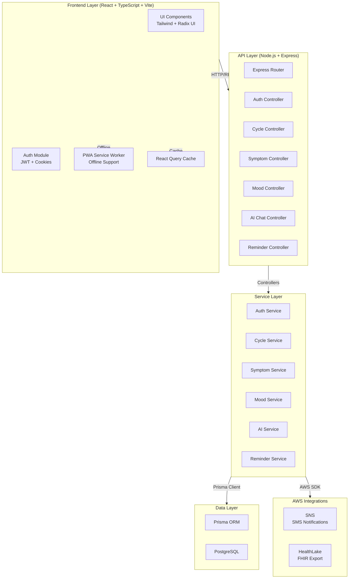

# Design Document: Health Tracking Application

## Overview

The Health Tracking Application is a production-ready full-stack system enabling users to monitor personal health metrics including menstrual cycles, symptoms, mood, and receive AI-powered health insights. The system employs a layered architecture with React frontend, Node.js/Express backend, PostgreSQL database via Prisma ORM, and AWS integrations for notifications and FHIR-compliant health data export. The application prioritizes security (JWT auth, HTTP-only cookies), performance (lazy loading, API caching), and user experience (PWA support, offline-first, dark/light mode, smooth animations).

## System Architecture



## Core Data Models

### User Model
```typescript
interface User {
  id: string                    // UUID primary key
  email: string                 // Unique, indexed
  username: string              // Unique
  passwordHash: string          // bcrypt hashed
  firstName: string
  lastName: string
  dateOfBirth: Date
  timezone: string              // For reminder scheduling
  preferences: {
    darkMode: boolean
    notificationsEnabled: boolean
    healthLakeExportEnabled: boolean
  }
  createdAt: Date
  updatedAt: Date
  
  // Relations
  cycles: Cycle[]
  symptoms: Symptom[]
  moods: Mood[]
  reminders: Reminder[]
  chatHistory: ChatHistory[]
}
```

### Cycle Model
```typescript
interface Cycle {
  id: string
  userId: string                // Foreign key
  startDate: Date               // Period start
  endDate: Date | null          // Period end (nullable)
  cycleLength: number           // Days
  periodLength: number          // Days
  notes: string
  createdAt: Date
  updatedAt: Date
}
```

### Symptom Model
```typescript
interface Symptom {
  id: string
  userId: string
  cycleId: string | null        // Optional relation to cycle
  date: Date
  type: string                  // e.g., "cramps", "headache", "bloating"
  severity: number              // 1-10 scale
  notes: string
  createdAt: Date
  updatedAt: Date
}
```

### Mood Model
```typescript
interface Mood {
  id: string
  userId: string
  date: Date
  mood: string                  // e.g., "happy", "anxious", "neutral"
  intensity: number             // 1-10 scale
  triggers: string[]            // Array of mood triggers
  notes: string
  createdAt: Date
  updatedAt: Date
}
```

### Reminder Model
```typescript
interface Reminder {
  id: string
  userId: string
  type: string                  // "period_alert", "medication", "custom"
  title: string
  description: string
  scheduledTime: Date
  frequency: string             // "once", "daily", "weekly", "monthly"
  isActive: boolean
  notificationMethod: string    // "sms", "email", "push"
  createdAt: Date
  updatedAt: Date
}
```

### ChatHistory Model
```typescript
interface ChatHistory {
  id: string
  userId: string
  message: string               // User message
  response: string              // AI response
  context: {
    recentMoods: Mood[]
    recentSymptoms: Symptom[]
    currentCycle: Cycle | null
  }
  createdAt: Date
}
```

## API Endpoints & Controllers

### Authentication Endpoints

```typescript
// POST /auth/signup
interface SignupRequest {
  email: string
  password: string
  firstName: string
  lastName: string
  dateOfBirth: Date
}

interface SignupResponse {
  user: {
    id: string
    email: string
    firstName: string
  }
  token: string
}

// POST /auth/login
interface LoginRequest {
  email: string
  password: string
}

interface LoginResponse {
  user: {
    id: string
    email: string
    firstName: string
  }
  token: string
}

// POST /auth/logout
// Returns: { success: boolean }

// GET /auth/me
// Returns: Current user profile
```

### Cycle Endpoints

```typescript
// GET /cycles - List all cycles for user
// Returns: Cycle[]

// POST /cycles - Create new cycle
interface CreateCycleRequest {
  startDate: Date
  periodLength: number
  cycleLength: number
  notes?: string
}

// GET /cycles/:id - Get cycle details
// PATCH /cycles/:id - Update cycle
// DELETE /cycles/:id - Delete cycle
```

### Symptom Endpoints

```typescript
// GET /symptoms - List symptoms (with optional date range filter)
// POST /symptoms - Log new symptom
interface LogSymptomRequest {
  type: string
  severity: number              // 1-10
  date: Date
  cycleId?: string
  notes?: string
}

// GET /symptoms/:id
// PATCH /symptoms/:id
// DELETE /symptoms/:id
```

### Mood Endpoints

```typescript
// GET /moods - List moods (with optional date range filter)
// POST /moods - Log new mood
interface LogMoodRequest {
  mood: string
  intensity: number             // 1-10
  date: Date
  triggers?: string[]
  notes?: string
}

// GET /moods/:id
// PATCH /moods/:id
// DELETE /moods/:id
```

### Reminder Endpoints

```typescript
// GET /reminders - List all reminders
// POST /reminders - Create reminder
interface CreateReminderRequest {
  type: string
  title: string
  description: string
  scheduledTime: Date
  frequency: string
  notificationMethod: string
}

// GET /reminders/:id
// PATCH /reminders/:id
// DELETE /reminders/:id
```

### AI Chat Endpoint

```typescript
// POST /ai/chat
interface ChatRequest {
  message: string
}

interface ChatResponse {
  response: string
  context: {
    recentMoods: Mood[]
    recentSymptoms: Symptom[]
    currentCycle: Cycle | null
  }
}
```

## Backend Service Layer Architecture

### Authentication Service

```typescript
class AuthService {
  // Precondition: email is valid, password meets requirements
  // Postcondition: user created with hashed password, JWT token generated
  async signup(email: string, password: string, userData: UserData): Promise<{user: User, token: string}>
  
  // Precondition: email exists, password is correct
  // Postcondition: JWT token generated, user session established
  async login(email: string, password: string): Promise<{user: User, token: string}>
  
  // Precondition: valid JWT token provided
  // Postcondition: token validated, user identity confirmed
  async validateToken(token: string): Promise<User>
  
  // Precondition: user authenticated
  // Postcondition: session cleared, token invalidated
  async logout(userId: string): Promise<void>
}
```

### Cycle Service

```typescript
class CycleService {
  // Precondition: userId valid, startDate is valid date
  // Postcondition: cycle record created with calculated fields
  async createCycle(userId: string, data: CreateCycleRequest): Promise<Cycle>
  
  // Precondition: userId valid
  // Postcondition: all cycles for user returned, sorted by date descending
  async getUserCycles(userId: string): Promise<Cycle[]>
  
  // Precondition: cycleId exists, belongs to userId
  // Postcondition: cycle updated, timestamps refreshed
  async updateCycle(cycleId: string, data: Partial<Cycle>): Promise<Cycle>
  
  // Precondition: cycleId exists
  // Postcondition: cycle deleted, related data handled
  async deleteCycle(cycleId: string): Promise<void>
  
  // Precondition: userId valid
  // Postcondition: returns current active cycle or null
  async getCurrentCycle(userId: string): Promise<Cycle | null>
}
```

### Symptom Service

```typescript
class SymptomService {
  // Precondition: userId valid, symptom data valid
  // Postcondition: symptom record created
  async logSymptom(userId: string, data: LogSymptomRequest): Promise<Symptom>
  
  // Precondition: userId valid, optional date range provided
  // Postcondition: symptoms returned, filtered and sorted by date
  async getUserSymptoms(userId: string, startDate?: Date, endDate?: Date): Promise<Symptom[]>
  
  // Precondition: symptomId exists, belongs to userId
  // Postcondition: symptom updated
  async updateSymptom(symptomId: string, data: Partial<Symptom>): Promise<Symptom>
  
  // Precondition: symptomId exists
  // Postcondition: symptom deleted
  async deleteSymptom(symptomId: string): Promise<void>
}
```

### Mood Service

```typescript
class MoodService {
  // Precondition: userId valid, mood data valid
  // Postcondition: mood record created
  async logMood(userId: string, data: LogMoodRequest): Promise<Mood>
  
  // Precondition: userId valid, optional date range provided
  // Postcondition: moods returned, filtered and sorted by date
  async getUserMoods(userId: string, startDate?: Date, endDate?: Date): Promise<Mood[]>
  
  // Precondition: moodId exists, belongs to userId
  // Postcondition: mood updated
  async updateMood(moodId: string, data: Partial<Mood>): Promise<Mood>
  
  // Precondition: moodId exists
  // Postcondition: mood deleted
  async deleteMood(moodId: string): Promise<void>
}
```

### AI Chat Service

```typescript
class AIChatService {
  // Precondition: userId valid, message non-empty
  // Postcondition: AI response generated using context, chat history saved
  async chat(userId: string, message: string): Promise<ChatResponse>
  
  // Precondition: userId valid
  // Postcondition: recent context (moods, symptoms, cycle) retrieved
  async buildContext(userId: string): Promise<ChatContext>
  
  // Precondition: userId valid, optional limit provided
  // Postcondition: chat history returned, most recent first
  async getChatHistory(userId: string, limit?: number): Promise<ChatHistory[]>
}
```

### Reminder Service

```typescript
class ReminderService {
  // Precondition: userId valid, reminder data valid
  // Postcondition: reminder created, scheduled job registered
  async createReminder(userId: string, data: CreateReminderRequest): Promise<Reminder>
  
  // Precondition: userId valid
  // Postcondition: all active reminders for user returned
  async getUserReminders(userId: string): Promise<Reminder[]>
  
  // Precondition: reminderId exists, belongs to userId
  // Postcondition: reminder updated, job rescheduled if time changed
  async updateReminder(reminderId: string, data: Partial<Reminder>): Promise<Reminder>
  
  // Precondition: reminderId exists
  // Postcondition: reminder deleted, scheduled job cancelled
  async deleteReminder(reminderId: string): Promise<void>
  
  // Precondition: reminderId exists, is active
  // Postcondition: SMS sent via SNS, delivery logged
  async sendReminder(reminderId: string): Promise<void>
}
```

## Frontend Architecture

### Core Screens & Components

```typescript
// Authentication Screens
interface LoginScreen {
  email: string
  password: string
  onSubmit: (credentials: LoginRequest) => Promise<void>
  isLoading: boolean
  error: string | null
}

interface SignupScreen {
  form: {
    email: string
    password: string
    firstName: string
    lastName: string
    dateOfBirth: Date
  }
  onSubmit: (data: SignupRequest) => Promise<void>
  isLoading: boolean
  error: string | null
}

// Dashboard Screen
interface DashboardScreen {
  currentCycle: Cycle | null
  recentMoods: Mood[]
  recentSymptoms: Symptom[]
  upcomingReminders: Reminder[]
  onNavigate: (screen: string) => void
}

// Cycle Tracker Screen
interface CycleTrackerScreen {
  cycles: Cycle[]
  currentCycle: Cycle | null
  onCreateCycle: (data: CreateCycleRequest) => Promise<void>
  onUpdateCycle: (cycleId: string, data: Partial<Cycle>) => Promise<void>
  onDeleteCycle: (cycleId: string) => Promise<void>
}

// Symptom Logger Screen
interface SymptomLoggerScreen {
  symptoms: Symptom[]
  onLogSymptom: (data: LogSymptomRequest) => Promise<void>
  onDeleteSymptom: (symptomId: string) => Promise<void>
  dateFilter: { start: Date; end: Date }
}

// Mood Tracker Screen
interface MoodTrackerScreen {
  moods: Mood[]
  onLogMood: (data: LogMoodRequest) => Promise<void>
  onDeleteMood: (moodId: string) => Promise<void>
  dateFilter: { start: Date; end: Date }
}

// AI Chat Assistant Screen
interface AIChatScreen {
  chatHistory: ChatHistory[]
  isLoading: boolean
  onSendMessage: (message: string) => Promise<void>
  error: string | null
}
```

### UI Component Library (Radix UI + Tailwind)

```typescript
// Reusable components
interface CardComponent {
  title: string
  children: React.ReactNode
  onClick?: () => void
  className?: string
}

interface ButtonComponent {
  label: string
  onClick: () => void
  variant: "primary" | "secondary" | "danger"
  isLoading?: boolean
  disabled?: boolean
}

interface InputComponent {
  label: string
  type: string
  value: string
  onChange: (value: string) => void
  error?: string
  placeholder?: string
}

interface ModalComponent {
  isOpen: boolean
  title: string
  children: React.ReactNode
  onClose: () => void
  actions: { label: string; onClick: () => void }[]
}
```

### Animation Specifications (Framer Motion)

```typescript
// Page Transitions
const pageTransition = {
  initial: { opacity: 0, y: 20 },
  animate: { opacity: 1, y: 0 },
  exit: { opacity: 0, y: -20 },
  transition: { duration: 0.3 }
}

// Card Hover Effect
const cardHover = {
  whileHover: { scale: 1.02, boxShadow: "0 10px 25px rgba(0,0,0,0.1)" },
  transition: { duration: 0.2 }
}

// Button Tap Feedback
const buttonTap = {
  whileTap: { scale: 0.95 },
  transition: { duration: 0.1 }
}

// Loading Skeleton Shimmer
const shimmer = {
  initial: { backgroundPosition: "200% center" },
  animate: { backgroundPosition: "-200% center" },
  transition: { duration: 1.5, repeat: Infinity }
}

// Chart Animation
const chartAnimation = {
  initial: { opacity: 0, y: 20 },
  animate: { opacity: 1, y: 0 },
  transition: { duration: 0.5, staggerChildren: 0.1 }
}
```

## Authentication Flow

```typescript
// Signup Flow
interface SignupFlow {
  // Step 1: User submits signup form
  // Precondition: email valid, password meets requirements (min 8 chars, mixed case, number)
  // Postcondition: validation passed
  validateSignupInput(data: SignupRequest): { valid: boolean; errors: string[] }
  
  // Step 2: Hash password with bcrypt
  // Precondition: password is plain text
  // Postcondition: password hashed with salt rounds = 10
  hashPassword(password: string): Promise<string>
  
  // Step 3: Create user in database
  // Precondition: email unique, password hashed
  // Postcondition: user record created with timestamps
  createUser(data: SignupRequest, passwordHash: string): Promise<User>
  
  // Step 4: Generate JWT token
  // Precondition: user created successfully
  // Postcondition: JWT token generated with 7-day expiry
  generateToken(userId: string): string
  
  // Step 5: Set HTTP-only cookie
  // Precondition: token generated
  // Postcondition: cookie set with secure, httpOnly, sameSite flags
  setAuthCookie(response: Response, token: string): void
}

// Login Flow
interface LoginFlow {
  // Step 1: Validate input
  // Precondition: email and password provided
  // Postcondition: validation passed
  validateLoginInput(data: LoginRequest): { valid: boolean; errors: string[] }
  
  // Step 2: Find user by email
  // Precondition: email valid
  // Postcondition: user found or null
  findUserByEmail(email: string): Promise<User | null>
  
  // Step 3: Compare passwords
  // Precondition: user found, password provided
  // Postcondition: comparison result boolean
  comparePasswords(plainPassword: string, hashedPassword: string): Promise<boolean>
  
  // Step 4: Generate JWT token
  // Precondition: password matches
  // Postcondition: JWT token generated
  generateToken(userId: string): string
  
  // Step 5: Set HTTP-only cookie
  // Precondition: token generated
  // Postcondition: cookie set with secure flags
  setAuthCookie(response: Response, token: string): void
}

// Auth Middleware
interface AuthMiddleware {
  // Precondition: request contains cookie or Authorization header
  // Postcondition: JWT validated, user attached to request
  verifyToken(token: string): Promise<User>
  
  // Precondition: request received
  // Postcondition: if valid token, next() called; else 401 returned
  authenticate(req: Request, res: Response, next: NextFunction): Promise<void>
}
```

## AWS Integrations

### SNS Integration (Notifications)

```typescript
class SNSNotificationService {
  // Precondition: userId valid, phone number stored in user profile
  // Postcondition: SMS sent via SNS, delivery status logged
  async sendSMSReminder(userId: string, message: string): Promise<void>
  
  // Precondition: reminderId exists, is active
  // Postcondition: scheduled job created using node-cron
  async scheduleReminder(reminderId: string, scheduledTime: Date): Promise<void>
  
  // Precondition: reminderId exists
  // Postcondition: scheduled job cancelled
  async cancelScheduledReminder(reminderId: string): Promise<void>
}

// Cron Job for Period Alerts
// Runs daily at 8 AM user's timezone
// Checks if user's cycle is starting today
// Sends SMS: "Your period is starting today. Track your symptoms in the app."

// Cron Job for Medication Reminders
// Runs at user-specified times
// Sends SMS: "Time for your medication reminder: [medication name]"
```

### HealthLake Integration (FHIR Export)

```typescript
class HealthLakeService {
  // Precondition: userId valid, user has health data
  // Postcondition: health data converted to FHIR format, exported to HealthLake
  async exportHealthDataToFHIR(userId: string): Promise<void>
  
  // Precondition: cycle data exists
  // Postcondition: cycle converted to FHIR Observation resource
  convertCycleToFHIR(cycle: Cycle): FHIRObservation
  
  // Precondition: symptom data exists
  // Postcondition: symptom converted to FHIR Condition resource
  convertSymptomToFHIR(symptom: Symptom): FHIRCondition
  
  // Precondition: mood data exists
  // Postcondition: mood converted to FHIR Observation resource
  convertMoodToFHIR(mood: Mood): FHIRObservation
}

// FHIR Export Rules:
// - Only export summarized medical records (aggregated data)
// - Do NOT store raw app data in HealthLake
// - Trigger export: After significant health events or user-requested export
// - Include: Period cycles, symptom patterns, mood trends
// - Exclude: Raw chat history, personal notes
```

## Error Handling & Validation

```typescript
// Global Error Handler
interface ErrorHandler {
  // Precondition: error thrown in any route/service
  // Postcondition: error logged, appropriate HTTP response sent
  handleError(error: Error, req: Request, res: Response): void
}

// Input Validation (Zod)
const signupSchema = z.object({
  email: z.string().email("Invalid email"),
  password: z.string().min(8, "Password must be 8+ characters").regex(/[A-Z]/, "Must contain uppercase").regex(/[0-9]/, "Must contain number"),
  firstName: z.string().min(1, "First name required"),
  lastName: z.string().min(1, "Last name required"),
  dateOfBirth: z.date()
})

const logSymptomSchema = z.object({
  type: z.enum(["cramps", "headache", "bloating", "fatigue", "mood_swings", "other"]),
  severity: z.number().min(1).max(10),
  date: z.date(),
  notes: z.string().optional()
})

// Rate Limiting
interface RateLimiter {
  // Precondition: request received
  // Postcondition: if rate limit exceeded, 429 returned; else next() called
  limit(req: Request, res: Response, next: NextFunction): void
}

// Security Headers
interface SecurityHeaders {
  // Precondition: response object
  // Postcondition: security headers set (CORS, CSP, X-Frame-Options, etc.)
  setSecurityHeaders(res: Response): void
}
```

## Performance Optimization

```typescript
// React Query Caching
interface CacheStrategy {
  // Precondition: API endpoint called
  // Postcondition: response cached for 5 minutes
  cyclesQuery: useQuery({
    queryKey: ['cycles'],
    queryFn: fetchCycles,
    staleTime: 5 * 60 * 1000
  })
  
  // Precondition: mood data requested
  // Postcondition: response cached for 10 minutes
  moodsQuery: useQuery({
    queryKey: ['moods'],
    queryFn: fetchMoods,
    staleTime: 10 * 60 * 1000
  })
}

// Lazy Loading Components
interface LazyLoadingStrategy {
  // Precondition: component not yet visible
  // Postcondition: component loaded on demand
  CycleTrackerScreen: React.lazy(() => import('./screens/CycleTracker'))
  SymptomLoggerScreen: React.lazy(() => import('./screens/SymptomLogger'))
  AIChatScreen: React.lazy(() => import('./screens/AIChat'))
}

// Database Query Optimization
interface QueryOptimization {
  // Precondition: userId provided
  // Postcondition: indexed query returns cycles in < 100ms
  getUserCycles: prisma.cycle.findMany({
    where: { userId },
    orderBy: { startDate: 'desc' },
    take: 12
  })
  
  // Precondition: userId and date range provided
  // Postcondition: indexed query returns symptoms in < 100ms
  getUserSymptomsByDateRange: prisma.symptom.findMany({
    where: {
      userId,
      date: { gte: startDate, lte: endDate }
    },
    orderBy: { date: 'desc' }
  })
}
```

## Correctness Properties

*A property is a characteristic or behavior that should hold true across all valid executions of a system—essentially, a formal statement about what the system should do. Properties serve as the bridge between human-readable specifications and machine-verifiable correctness guarantees.*

### Property 1: Password Hashing Security

For any user signup, the stored password hash must be different from the input password and must be a valid bcrypt hash.

**Validates: Requirements 1.4**

### Property 2: JWT Token Validity and Expiry

For any successful login, the returned JWT token must be valid and must have an expiry time of exactly 7 days from the current time.

**Validates: Requirements 2.1**

### Property 3: Token Validation and User Identity

For any valid JWT token provided in a request, the token must decode successfully and must attach the correct user identity to the request.

**Validates: Requirements 2.5**

### Property 4: Cycle Date Ordering

For any cycle record, the start date must be less than or equal to the end date, or the end date must be null (indicating an ongoing cycle).

**Validates: Requirements 5.1, 5.4**

### Property 5: User Data Isolation in Cycles

For any set of cycles retrieved for a user, all cycles in the result set must belong to that user (cycle.userId equals the requested userId).

**Validates: Requirements 5.3**

### Property 6: Symptom Severity Range

For any symptom logged, the severity value must be between 1 and 10 inclusive.

**Validates: Requirements 6.2**

### Property 7: Symptom Date Range Filtering

For any symptom query with a date range filter, all returned symptoms must have dates within the specified range (startDate ≤ symptom.date ≤ endDate).

**Validates: Requirements 6.5**

### Property 8: Mood Intensity Range

For any mood logged, the intensity value must be between 1 and 10 inclusive.

**Validates: Requirements 7.2**

### Property 9: Mood Type Validation

For any mood logged, the mood type must be one of the predefined types: happy, anxious, neutral, sad, energetic, calm, irritable, or other.

**Validates: Requirements 7.3**

### Property 10: Mood Date Range Filtering

For any mood query with a date range filter, all returned moods must have dates within the specified range (startDate ≤ mood.date ≤ endDate).

**Validates: Requirements 7.5**

### Property 11: Reminder Active Status Default

For any reminder created, the isActive flag must be set to true by default.

**Validates: Requirements 8.5**

### Property 12: Reminder Scheduled Time Validation

For any reminder created, the scheduled time must be in the future (scheduledTime > now()).

**Validates: Requirements 8.2**

### Property 13: User Data Isolation in Reminders

For any set of reminders retrieved for a user, all reminders in the result set must belong to that user and must be active (reminder.userId equals the requested userId and reminder.isActive = true).

**Validates: Requirements 8.6**

### Property 14: AI Chat Response Non-Empty

For any message sent to the AI chat, the response must be non-empty and must be contextually relevant to the input message.

**Validates: Requirements 10.1**

### Property 15: Chat History Sorting

For any chat history retrieved, the messages must be sorted by creation date in descending order (most recent first).

**Validates: Requirements 10.5**

### Property 16: FHIR Cycle Conversion

For any cycle exported to FHIR format, the cycle must be converted to a valid FHIR Observation resource with appropriate fields mapped.

**Validates: Requirements 11.2**

### Property 17: FHIR Symptom Conversion

For any symptom exported to FHIR format, the symptom must be converted to a valid FHIR Condition resource with appropriate fields mapped.

**Validates: Requirements 11.3**

### Property 18: FHIR Mood Conversion

For any mood exported to FHIR format, the mood must be converted to a valid FHIR Observation resource with appropriate fields mapped.

**Validates: Requirements 11.4**

### Property 19: Health Data Export Exclusion

For any health data export, raw chat history and personal notes must be excluded from the export (only aggregated data is included).

**Validates: Requirements 11.5, 11.6**

### Property 20: Service Worker Asset Caching

For any application load, the Service Worker must register successfully and must cache essential assets for offline access.

**Validates: Requirements 12.1**

### Property 21: Offline Read Operations

For any read operation (viewing cycles, symptoms, moods) performed while offline, the operation must succeed using cached data.

**Validates: Requirements 12.3**

### Property 22: Offline Write Operation Queuing

For any write operation (create, update, delete) performed while offline, the operation must be queued for later sync.

**Validates: Requirements 12.4**

### Property 23: Theme Preference Persistence

For any user theme preference change, the preference must be persisted to the database and must be applied on subsequent logins.

**Validates: Requirements 13.1, 13.4**

### Property 24: Input Validation Error Messages

For any form submission with invalid data, specific validation error messages must be displayed for each invalid field.

**Validates: Requirements 15.1**

### Property 25: HTTP Status Code Correctness

For any API request that fails, the response must include an appropriate HTTP status code (401 for unauthorized, 403 for forbidden, 404 for not found, 500 for server error).

**Validates: Requirements 15.2, 15.4, 15.5, 15.6**

### Property 26: Rate Limiting Enforcement

For any client making more than 100 requests in 15 minutes, the system must return a 429 Too Many Requests response.

**Validates: Requirements 16.1**

### Property 27: Security Headers Presence

For any HTTP response, security headers must be included (X-Frame-Options, X-Content-Type-Options, Strict-Transport-Security).

**Validates: Requirements 16.3**

### Property 28: SQL Injection Prevention

For any user input submitted to the system, SQL injection attacks must be prevented through parameterized queries via Prisma ORM.

**Validates: Requirements 16.5**

### Property 29: Query Performance - Cycles

For any user retrieving their cycles, the database query must complete in less than 100ms using indexed queries.

**Validates: Requirements 17.1**

### Property 30: Query Performance - Symptoms

For any user retrieving symptoms with a date range filter, the database query must complete in less than 100ms using indexed queries.

**Validates: Requirements 17.2**

### Property 31: Query Performance - Moods

For any user retrieving moods with a date range filter, the database query must complete in less than 100ms using indexed queries.

**Validates: Requirements 17.3**

### Property 32: React Query Cache - Cycles

For any cycle retrieval, the response must be cached for 5 minutes using React Query.

**Validates: Requirements 18.1**

### Property 33: React Query Cache - Moods

For any mood retrieval, the response must be cached for 10 minutes using React Query.

**Validates: Requirements 18.2**

### Property 34: React Query Cache - Symptoms

For any symptom retrieval, the response must be cached for 10 minutes using React Query.

**Validates: Requirements 18.3**

### Property 35: Cache Invalidation on Data Mutation

For any create, update, or delete operation, the relevant cache entries must be invalidated to ensure fresh data on next retrieval.

**Validates: Requirements 18.4**

### Property 36: Lazy Loading of Non-Critical Screens

For any application load, non-critical screens (CycleTracker, SymptomLogger, AIChat) must be lazy loaded and not included in the initial bundle.

**Validates: Requirements 19.1**

### Property 37: Keyboard Navigation Accessibility

For any interactive element in the application, keyboard navigation must be supported and must be accessible via Tab and Enter keys.

**Validates: Requirements 20.1**

### Property 38: ARIA Labels and Semantic HTML

For any UI component, appropriate ARIA labels and semantic HTML must be present for screen reader compatibility.

**Validates: Requirements 20.2**

## Testing Strategy

### Unit Testing Approach

Test each service layer function independently with mocked dependencies:
- Auth Service: signup, login, token validation, password hashing
- Cycle Service: CRUD operations, date calculations, current cycle detection
- Symptom Service: logging, filtering by date range, severity validation
- Mood Service: logging, intensity validation, trigger tracking
- AI Chat Service: message processing, context building, history retrieval
- Reminder Service: creation, scheduling, cancellation

### Property-Based Testing Approach

**Property Test Library**: fast-check (for TypeScript/JavaScript)

Key properties to test:
- Date range queries always return data within specified range
- Severity/intensity values always within 1-10 range
- User data isolation: queries for userId A never return data from userId B
- Cycle dates: startDate always ≤ endDate
- Password hashing: same password always produces different hashes (due to salt)
- JWT tokens: valid tokens always decode to correct user ID
- Reminder scheduling: scheduled time always in future

### Integration Testing Approach

Test complete workflows:
- Signup → Login → Create Cycle → Log Symptom → View Dashboard
- Login → Create Reminder → Receive SMS notification
- Login → Chat with AI → Verify context includes recent moods/symptoms
- Export health data → Verify FHIR format compliance

## Security Considerations

- **Password Security**: Bcrypt with 10 salt rounds, minimum 8 characters with mixed case and numbers
- **JWT Security**: 7-day expiry, HTTP-only cookies, secure flag, sameSite=strict
- **Input Validation**: Zod schemas for all endpoints, sanitize user inputs
- **Rate Limiting**: 100 requests per 15 minutes per IP
- **CORS**: Whitelist frontend domain only
- **HTTPS**: Enforce in production
- **Environment Variables**: Store secrets (JWT_SECRET, AWS credentials, OpenAI key) in .env
- **SQL Injection Prevention**: Use Prisma ORM (parameterized queries)
- **XSS Prevention**: React auto-escapes, Content Security Policy headers
- **CSRF Protection**: SameSite cookies, CSRF tokens for state-changing operations

## Performance Considerations

- **Frontend**: Lazy load screens, React Query caching (5-10 min stale time), code splitting with Vite
- **Backend**: Database indexes on userId, date fields; connection pooling; response compression
- **Database**: Indexed queries on userId, date; pagination for large result sets; query optimization
- **Caching**: Redis for session storage (optional), API response caching
- **PWA**: Service worker caches assets, offline-first for read operations

## Dependencies

**Frontend**:
- react, react-dom, typescript, vite
- tailwindcss, radix-ui
- framer-motion
- react-query
- axios
- zod

**Backend**:
- express, typescript, node
- prisma, @prisma/client
- bcryptjs
- jsonwebtoken
- zod
- node-cron
- aws-sdk
- openai (or @google/generative-ai)
- cors, helmet, express-rate-limit

**Database**:
- postgresql
- prisma (ORM)

**Deployment**:
- Vercel (frontend)
- Render/Railway (backend)
- Supabase/Neon (PostgreSQL)
